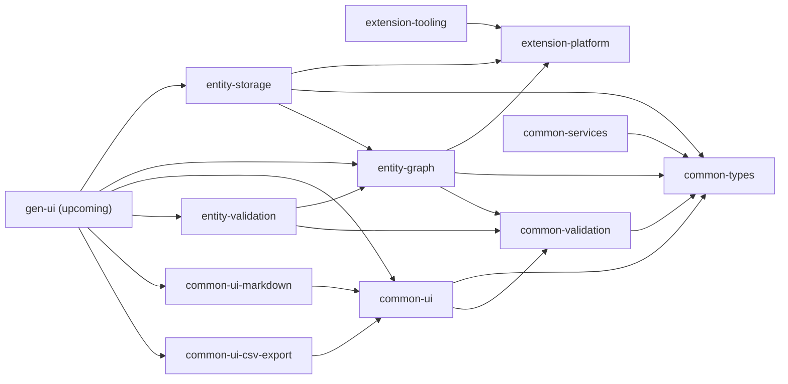

# seij-commons-js

[Seij](https://www.seij.net)'s shared JavaScript/TypeScript commons: a single monorepo where we publish
tools used across our projects so we stop reinventing the wheel. It supports
both our open source work and private software, and serves as Seij's open source
layer for JavaScript. Everything is written in TypeScript.

At its core, this repo provides a runtime, extension-driven architecture for
business UIs: an extension platform plus a domain stack that turns backend model
descriptions into dynamic screens. The flow is: model definitions
(`entity-graph`) → data access (`entity-storage`) → UI shell (`gen-ui`,
upcoming), with extension points to enrich and specialize screens.

It is not built as a framework but as a toolkit: depending on the product, Seij
uses all or only parts of the stack.

## Audience

- Internal teams at [Seij](https://www.seij.net)
- Customers who depend on Seij libraries
- Medatarun project maintainers

## What it provides

- Core language utilities and common types
- UI building blocks for business-oriented software
- A lightweight runtime extension system for JS/TS (think Eclipse, VSCode, or
  IntelliJ-style plugins)
- Tools for managing business entities in business-oriented software

## Tech and dependencies

- TypeScript-first libraries consumed as packages
- UI overlays on Fluent UI with React (`common-ui-*` modules), with a goal of
  framework agnosticism
- OpenID Connect integration via `react-oidc-context` and `oidc-client-ts`
  (`common-ui-auth` module)
- Markdown tooling based on `remark`/`rehype`

## Maturity and scope

These libraries are used in production and are considered mature for [Seij](https://www.seij.net)'s
ecosystem. 

They also serve as base tooling for [Medatarun](https://www.medatarun.com) UI.

They are not designed to be used as building blocks by a generic audience.
